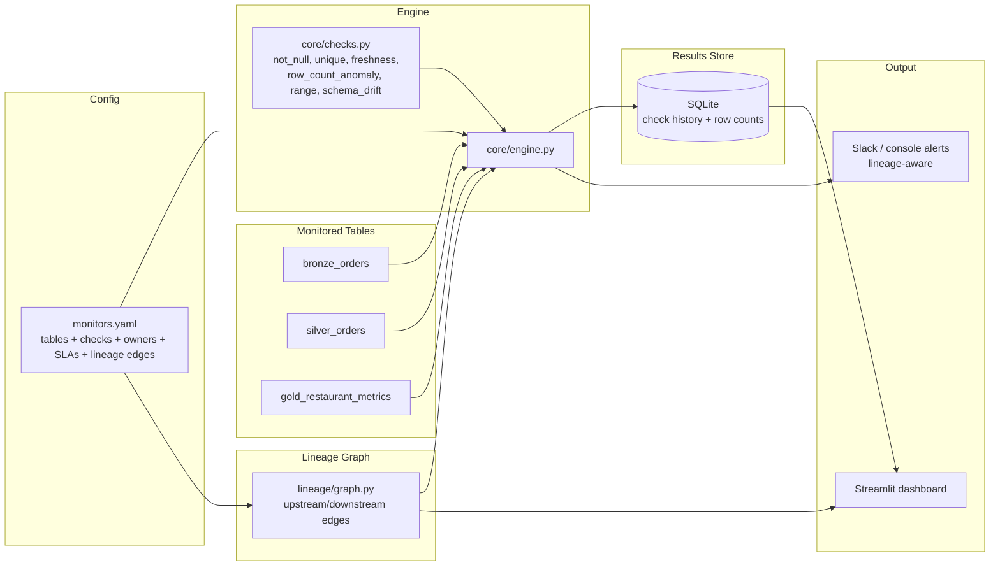

# Data Quality & Observability Framework

A lightweight, config-driven data quality and observability framework: declare
a table and its checks in YAML, and the engine runs them, tracks history,
computes volume-anomaly baselines, traces lineage-aware blast radius, and
alerts on failure — no per-table Python code required.

Built to monitor a medallion-style pipeline (`bronze_orders` → `silver_orders`
→ `gold_restaurant_metrics`), the same shape as the
[Real-Time Streaming Lakehouse](https://github.com/akonagalla28/realtime-streaming-lakehouse)
project, so it doubles as a concrete demo of monitoring that pipeline in
production.

## Why this exists

Most data quality tooling either requires writing a test per table (doesn't
scale) or is a full commercial platform (Monte Carlo, Bigeye) that's opaque
to read. This framework implements the core mechanics — declarative checks,
historical baselines, lineage-aware alerting — in readable Python, so the
approach itself is the artifact, not just the working code.

## Architecture



**The key design point:** checks are declared, not coded. Adding a new table
to monitor means adding a YAML block to `config/monitors.yaml` — the engine
dispatches to the right check functions generically. Lineage edges come from
the same config (`upstream: [...]`), so there's no separate lineage system to
keep in sync with reality.

## What's inside

| Path | Purpose |
|---|---|
| `config/monitors.yaml` | Declares tables, checks, owners, freshness SLAs, lineage edges |
| `core/config_loader.py` | Parses YAML into typed config objects |
| `core/checks.py` | Check implementations: not_null, unique, freshness, row_count_anomaly, range, schema_drift |
| `core/engine.py` | Orchestrates: load table → run checks → persist → alert |
| `storage/results_store.py` | SQLite history, used for anomaly baselines and dashboard trends |
| `lineage/graph.py` | Builds upstream/downstream graph from config; computes blast radius |
| `alerting/notifier.py` | Slack webhook + console notifier, with lineage-aware alert text |
| `dashboard/app.py` | Streamlit health dashboard: per-table status, failed checks, row-count trends |
| `data/generate_sample_data.py` | Synthetic bronze/silver/gold data with **intentionally injected issues** (null spike, out-of-range values, stale freshness) so running the framework produces real, demonstrable failures |
| `tests/test_checks.py` | Verifies each check catches its target failure mode + lineage graph correctness |

## Quick start

```bash
python -m venv .venv && source .venv/bin/activate
pip install -r requirements.txt

# 1. Generate synthetic tables (with injected DQ issues by default)
python data/generate_sample_data.py

# 2. Run all checks -- this will print alerts to console (or Slack, if
#    SLACK_WEBHOOK_URL is set) for every injected issue
python run_checks.py

# 3. View results in the dashboard
streamlit run dashboard/app.py
# open http://localhost:8501

# 4. Run the test suite
pytest tests/ -v
```

### Expected first-run output

Running against the default synthetic data (issues injected) should surface:
```
[FAIL] bronze_orders   -- 15 null restaurant_ids
[FAIL] silver_orders   -- 3 rows with negative prep_time_minutes
[FAIL] gold_restaurant_metrics -- data is 200min old, breaching the 180min SLA
```
Each alert also lists downstream tables that could be affected, using the
lineage graph built from `upstream:` edges in the config.

## Notable design decisions

- **Checks are config, not code.** A new table means a new YAML block, not a
  new Python file. This is what lets the framework scale to dozens of tables
  without a linear increase in maintenance burden.
- **Volume anomaly detection needs real history, not a fixed threshold.**
  `row_count_anomaly` computes a z-score against the trailing N days of actual
  row counts stored in SQLite, rather than a hardcoded "must have > X rows"
  rule that breaks the moment normal volume changes seasonally.
- **Lineage comes from the same config as the checks**, not a separate system.
  Every table declares its own `upstream` dependencies, and the graph +
  blast-radius calculation is derived from that, so lineage can never drift out
  of sync with the checks themselves.
- **Alerts are lineage-aware.** A bronze-layer failure tells you which
  downstream tables will look wrong next, so on-call triage starts with "how
  bad is this" instead of a flat list of failed assertions.

## Possible extensions

- Swap the Streamlit dashboard's SQLite backend for Postgres/Timescale for
  multi-user, longer-retention deployments.
- Add a "known issue" suppression window so a still-ongoing failure doesn't
  re-alert on every single run.
- Point `data/generate_sample_data.py`'s table names at the real
  `realtime-streaming-lakehouse` Delta tables to monitor that pipeline directly.
